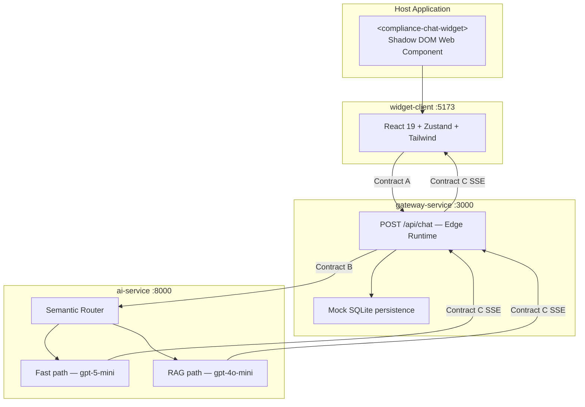

# Compliance Chatbot Overlay

Enterprise-grade, **fully decoupled** compliance chat overlay built on the **Sandboxed Vibe Coding** philosophy: three independent modules with **zero shared code** and **zero cross-imports**. Each module communicates only via HTTP/JSON and Server-Sent Events (SSE). Any module can be rewritten from scratch as long as the [Data Exchange Contracts](#data-exchange-contracts) are honored.

## Architecture



### Module boundaries

| Module | Port (dev) | Responsibility | Tech |
|--------|------------|----------------|------|
| [widget-client](./widget-client/) | 5173 | Embeddable UI, role toggle, SSE client | React 19, Vite, Tailwind, Zustand |
| [gateway-service](./gateway-service/) | 3000 | Session proxy, mock DB, stream passthrough | Next.js 16.1.4, Edge API |
| [ai-service](./ai-service/) | 8000 | Semantic routing, RAG, LLM streaming | FastAPI, LangChain, ChromaDB |

**Isolation rule:** No shared packages, monorepo libs, or cross-folder imports. Integration is contract-only.

---

## Data Exchange Contracts

These contracts are the **only** coupling surface between modules.

### Contract A — Widget → Gateway

`POST http://localhost:3000/api/chat`

```json
{
  "sessionId": "sess_123",
  "role": "reviewer",
  "message": "Check compliance."
}
```

| Field | Type | Description |
|-------|------|-------------|
| `sessionId` | `string` | Stable conversation identifier |
| `role` | `"user"` \| `"reviewer"` | Active persona; affects AI routing |
| `message` | `string` | User utterance |

**Response:** `text/event-stream` (Contract C)

---

### Contract B — Gateway → AI Service

`POST http://localhost:8000/v1/chat/stream`

```json
{
  "conversation_id": "sess_123",
  "role": "reviewer",
  "query": "Check compliance.",
  "context_history": []
}
```

| Field | Type | Description |
|-------|------|-------------|
| `conversation_id` | `string` | Maps from Contract A `sessionId` |
| `role` | `"user"` \| `"reviewer"` | Forwarded role |
| `query` | `string` | Maps from Contract A `message` |
| `context_history` | `array` | Prior turns `{ role, content }` |

**Response:** `text/event-stream` (Contract C)

---

### Contract C — AI → Gateway → Widget (SSE)

Each event is one line starting with `data:` followed by JSON.

```text
data: {"type": "token", "content": "Looks "}
data: {"type": "token", "content": "good."}
data: {"type": "done"}
```

| Event `type` | Fields | Meaning |
|--------------|--------|---------|
| `token` | `content: string` | Incremental assistant text |
| `done` | — | Stream complete |
| `error` | `content?: string` | Optional failure (clients should handle) |

---

## Run locally (full stack)

Start all three services in separate terminals. **Order:** AI → Gateway → Widget.

### 1. AI Service

```powershell
cd ai-service
python -m venv .venv
.\.venv\Scripts\Activate.ps1
pip install -r requirements.txt
uvicorn app.main:app --reload --port 8000
```

Health check: [http://localhost:8000/health](http://localhost:8000/health)

### 2. Gateway Service

```powershell
cd gateway-service
npm install
npm run dev
```

API: [http://localhost:3000/api/chat](http://localhost:3000/api/chat)

### 3. Widget Client

```powershell
cd widget-client
npm install
npm run dev
```

Open the Vite dev URL (default [http://localhost:5173](http://localhost:5173)), open the chat bubble, and send a message.

### Quick smoke test (curl)

With AI and Gateway running:

```powershell
curl -X POST http://localhost:3000/api/chat `
  -H "Content-Type: application/json" `
  -H "Accept: text/event-stream" `
  -d '{"sessionId":"sess_test","role":"reviewer","message":"Check compliance."}'
```

You should see streamed `data:` lines in the response.

---

## Environment variables

| Service | Variable | Default | Purpose |
|---------|----------|---------|---------|
| Gateway | `AI_SERVICE_URL` | `http://localhost:8000/v1/chat/stream` | AI stream endpoint |
| AI | `GROQ_API_KEY` | — | Groq API key (default provider) |
| AI | `GROQ_MODEL` | `llama-3.3-70b-versatile` | Groq chat model |
| AI | `USE_AZURE` | `false` | Set `true` to use Azure instead of Groq |
| AI | `AZURE_OPENAI_ENDPOINT` | — | Azure OpenAI resource URL |
| AI | `AZURE_OPENAI_API_KEY` | — | API key |
| AI | `AZURE_OPENAI_API_VERSION` | `2024-08-01-preview` | API version |
| AI | `AZURE_OPENAI_DEPLOYMENT_FAST` | `gpt-5-mini` | Fast chat deployment |
| AI | `AZURE_OPENAI_DEPLOYMENT_RAG` | `gpt-4o-mini` | RAG deployment |
| AI | `AZURE_OPENAI_EMBEDDING_DEPLOYMENT` | `text-embedding-3-large` | Embeddings |

See [ai-service/.env.example](./ai-service/.env.example) for a template.

---

## Embed the widget in a host app

After building the widget:

```powershell
cd widget-client
npm run build
```

Serve `dist/compliance-chat-widget.iife.js` and add:

```html
<script type="module" src="/path/to/compliance-chat-widget.iife.js"></script>
<compliance-chat-widget gateway-url="http://localhost:3000/api/chat"></compliance-chat-widget>
```

| Attribute | Description |
|-----------|-------------|
| `gateway-url` | Contract A endpoint (required in production) |
| `open` | `"true"` to open panel on load |

---

## Repository layout

```
ABB Chatbot Overlay/
├── README.md                 ← this file
├── ai-service/
│   └── README.md
├── gateway-service/
│   └── README.md
└── widget-client/
    └── README.md
```

---

## Design principles

1. **Contract-first integration** — Change internals freely; do not change contracts without coordinating all three modules.
2. **Stream-first UX** — Tokens pass through the gateway without buffering the full response before the client sees data.
3. **Shadow DOM isolation** — Widget styles and layout do not affect the host page.
4. **Semantic routing** — Reviewer role and compliance keywords select the RAG path in the AI service.
5. **Production path** — Mock streams and in-memory DB are placeholders; swap for Azure OpenAI and real SQLite/Postgres without changing HTTP contracts.

---

## Module documentation

- [ai-service/README.md](./ai-service/README.md) — FastAPI, routing, Azure OpenAI
- [gateway-service/README.md](./gateway-service/README.md) — Next.js Edge proxy, persistence
- [widget-client/README.md](./widget-client/README.md) — Web Component, Zustand, embedding

---

## Troubleshooting

| Symptom | Likely cause | Fix |
|---------|--------------|-----|
| Widget shows network error | Gateway not running or wrong `gateway-url` | Start gateway on :3000; check attribute |
| Gateway returns 502 | AI service down | Start `uvicorn` on :8000 |
| Empty stream | AI returned non-SSE body | Check AI logs; verify Contract C format |
| CORS error | Gateway CORS misconfigured | Gateway allows `*` for dev; tighten in prod |
| Edge cannot reach localhost AI | Some Edge hosts block private URLs | Use `AI_SERVICE_URL` pointing to a reachable host in deploy |

---

## Version manifest

| Layer | Packages |
|-------|----------|
| Widget | React 19.0.0, Vite, TypeScript, Tailwind, Zustand, Lucide |
| Gateway | Next.js 16.1.4, React 19.0.0, TypeScript |
| AI | Python 3.10+, FastAPI 0.129.0, Uvicorn 0.41.0, LangChain 1.x, ChromaDB 1.5.0, OpenAI 2.21.0 |

Pinned versions live in each module’s `package.json` or `requirements.txt`.
