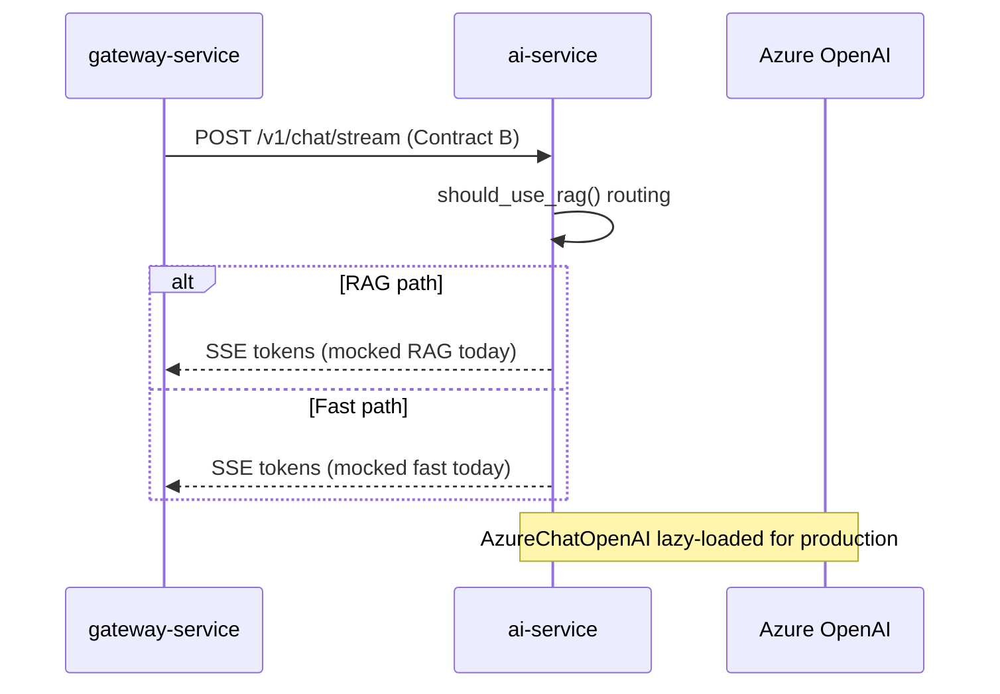

# AI Service

Headless FastAPI microservice for **semantic routing**, **RAG**, and **LLM text streaming**. This module has no knowledge of the widget or gateway beyond **Contract B** (inbound) and **Contract C** (outbound SSE).

## Role in the system



The gateway proxies Contract C verbatim to the widget. The AI service never calls the gateway or widget.

---

## Tech stack

| Package | Version |
|---------|---------|
| Python | 3.10+ |
| FastAPI | 0.129.0 |
| Uvicorn | 0.41.0 |
| Pydantic | 2.12.5 |
| chromadb | 1.5.0 |
| langchain-classic | 1.0.1 |
| langchain-community | 0.4.1 |
| langchain-core | 1.2.14 |
| langchain-openai | 1.1.10 |
| openai | 2.21.0 |

**LLM targets (Azure OpenAI):**

- `gpt-5-mini` — fast chat path
- `gpt-4o-mini` — RAG path
- `text-embedding-3-large` — embeddings (reserved for future Chroma RAG)

---

## API reference

### `GET /health`

```json
{ "status": "ok", "service": "ai-service" }
```

### `POST /v1/chat/stream`

**Contract B** request body:

```json
{
  "conversation_id": "sess_123",
  "role": "reviewer",
  "query": "Check compliance.",
  "context_history": []
}
```

**Response:** `Content-Type: text/event-stream`

**Contract C** events:

```text
data: {"type": "token", "content": "..."}
data: {"type": "done"}
```

---

## LLM factory (`app/llm_factory.py`)

| Provider | When | Env |
|----------|------|-----|
| **Groq** (default) | `USE_AZURE` unset or false | `GROQ_API_KEY`, `GROQ_MODEL` |
| **Azure OpenAI** | `USE_AZURE=true` | `AZURE_OPENAI_*` (original config preserved) |

```python
from app.llm_factory import get_llm

llm = get_llm(streaming=True)   # chat streams
llm = get_llm(streaming=False)  # intent classification
```

Swap back to Azure instantly: set `USE_AZURE=true` in `.env` and restart.

## Intent-based semantic routing

Implemented in `app/routers/semantic_router.py`. The LLM classifies each query (strict Pydantic JSON parser) into:

| Intent | Data source | Current behavior |
|--------|-------------|------------------|
| `REPORT_QUERY` | Structured report DB (controls, evidence, status, reason) | Mock SSE: `[MOCK REPORT DATA]` |
| `KNOWLEDGE_BASE` | Vector KB (policies, uploads, evidence rules) | Mock SSE: `[MOCK KNOWLEDGE BASE]` |
| `GENERAL_CHAT` | None — conversational fallback | Mock SSE greeting |

`analyze_intent(query, chat_history)` runs before streaming. Example prompts:

- *"Why did control AC-2 fail with partial compliance?"* → `REPORT_QUERY`
- *"How do I upload evidence for a control?"* → `KNOWLEDGE_BASE`
- *"Hello!"* → `GENERAL_CHAT`

---

## Project structure

```
ai-service/
├── requirements.txt
├── .env.example
└── app/
    ├── main.py                 # FastAPI app, /v1/chat/stream
    ├── llm_factory.py          # Groq (default) / Azure via USE_AZURE
    ├── models/
    │   └── contracts.py        # Pydantic Contract B models
    └── routers/
        └── semantic_router.py  # Intent routing + SSE handlers
```

---

## Run locally

### Prerequisites

- Python 3.10 or newer
- Recommended: virtual environment

### Install and start

```powershell
cd ai-service
python -m venv .venv
.\.venv\Scripts\Activate.ps1
pip install -r requirements.txt
copy .env.example .env
# Edit .env with Azure OpenAI values when going live
uvicorn app.main:app --reload --port 8000
```

### Verify

```powershell
curl http://localhost:8000/health
```

```powershell
curl -X POST http://localhost:8000/v1/chat/stream `
  -H "Content-Type: application/json" `
  -N `
  -d '{"conversation_id":"sess_1","role":"reviewer","query":"Check compliance.","context_history":[]}'
```

---

## Environment variables

| Variable | Default | Description |
|----------|---------|-------------|
| `GROQ_API_KEY` | `""` | Groq API key (required unless `USE_AZURE=true`) |
| `GROQ_MODEL` | `llama-3.3-70b-versatile` | Groq chat model |
| `USE_AZURE` | `false` | Set `true` to use Azure instead of Groq |
| `AZURE_OPENAI_ENDPOINT` | `""` | Azure resource endpoint |
| `AZURE_OPENAI_API_KEY` | `""` | API key |
| `AZURE_OPENAI_API_VERSION` | `2024-08-01-preview` | API version |
| `AZURE_OPENAI_DEPLOYMENT_FAST` | `gpt-5-mini` | Fast chat deployment name |
| `AZURE_OPENAI_DEPLOYMENT_RAG` | `gpt-4o-mini` | RAG deployment name |
| `AZURE_OPENAI_EMBEDDING_DEPLOYMENT` | `text-embedding-3-large` | Embedding deployment |

Copy `.env.example` to `.env` and load with your process manager or `python-dotenv` if you add startup loading in `main.py`.

---

## Contracts (this module’s view)

| Direction | Contract | Endpoint |
|-----------|----------|----------|
| Inbound | **B** | `POST /v1/chat/stream` |
| Outbound | **C** | SSE body on same response |

**Inbound model** (`app/models/contracts.py`):

- `ChatStreamRequest` — `conversation_id`, `role`, `query`, `context_history`
- `ContextMessage` — `role` (`user` \| `reviewer` \| `assistant`), `content`

**Outbound SSE helper** — `_sse_chunk(type, content?)` formats Contract C lines.

---

## Going to production

1. Replace `handle_report_query` / `handle_kb_query` mocks with real DB + Chroma retrieval, streaming via `get_llm(streaming=True).astream()`.
2. Keep `analyze_intent` for routing; optionally log `reasoning` for audit.
3. Keep SSE shape identical — clients and gateway depend only on Contract C.
4. Restrict CORS at the gateway; this service can remain internal (no public browser access).

---

## Dependencies note

Install only from `requirements.txt` inside a dedicated venv to avoid conflicts with other global LangChain versions on your machine.
