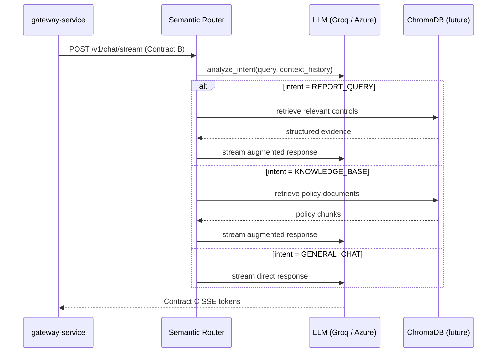

# AI Service

Headless **FastAPI** microservice for **semantic intent routing**, **RAG retrieval**, and **LLM text streaming**. This module has no knowledge of the widget or gateway beyond **Contract B** (inbound request) and **Contract C** (outbound SSE response). It never calls either of the other services.

---

## Role in the System



The gateway proxies Contract C bytes verbatim to the widget. The AI service never calls back to the gateway or widget.

---

## Tech Stack

| Package | Version |
|---------|---------|
| Python | 3.10+ |
| FastAPI | 0.129.0 |
| Uvicorn | 0.41.0 |
| Pydantic | 2.12.5 |
| LangChain-Groq | 0.3.3 |
| LangChain-OpenAI | 1.1.10 |
| LangChain-Core | 1.2.14 |
| LangChain-Community | 0.4.1 |
| LangChain-Classic | 1.0.1 |
| OpenAI SDK | 2.21.0 |
| ChromaDB | 1.5.0 |
| python-dotenv | 1.0.1 |

Full pinned versions are in `requirements.txt`.

---

## Prerequisites

- Python 3.10 or newer
- A virtual environment (strongly recommended — LangChain has many transitive dependencies)
- A valid `GROQ_API_KEY` **or** Azure OpenAI credentials (see [Environment Variables](#environment-variables))

---

## Python Virtual Environment Setup

```powershell
cd ai-service

# Create the virtual environment
python -m venv .venv

# Activate it (PowerShell)
.\.venv\Scripts\Activate.ps1

# Install all dependencies from the pinned requirements file
pip install -r requirements.txt
```

> **Why a dedicated venv?** LangChain installs many transitive packages (OpenAI, tiktoken, numpy, etc.). Isolating them in a venv prevents version conflicts with any other globally-installed LangChain or OpenAI packages on your machine.

---

## Environment Variables

Copy `.env.example` to `.env` and fill in the values for your chosen LLM provider:

```powershell
copy .env.example .env
# Then edit .env in your editor
```

### `.env.example` (full contents)

```env
# --- LLM provider (default: Groq) ---
GROQ_API_KEY=your-groq-api-key
GROQ_MODEL=llama-3.3-70b-versatile

# Set to true/1/yes to use Azure instead of Groq
USE_AZURE=false

# --- Azure OpenAI (when USE_AZURE=true) ---
AZURE_OPENAI_ENDPOINT=https://your-resource.openai.azure.com/
AZURE_OPENAI_API_KEY=your-api-key
AZURE_OPENAI_API_VERSION=2024-08-01-preview
AZURE_OPENAI_DEPLOYMENT_FAST=gpt-5-mini
AZURE_OPENAI_DEPLOYMENT_RAG=gpt-4o-mini
AZURE_OPENAI_EMBEDDING_DEPLOYMENT=text-embedding-3-large
```

### Full Variable Reference

| Variable | Default | Required | Description |
|----------|---------|----------|-------------|
| `GROQ_API_KEY` | `""` | Yes (if Groq) | Groq API key. Get one at [console.groq.com](https://console.groq.com). |
| `GROQ_MODEL` | `llama-3.3-70b-versatile` | No | Groq model identifier for chat completions. |
| `USE_AZURE` | `false` | No | Set `true` (or `1` or `yes`) to switch the LLM provider from Groq to Azure OpenAI. |
| `AZURE_OPENAI_ENDPOINT` | `""` | Yes (if Azure) | Your Azure OpenAI resource URL, e.g. `https://my-resource.openai.azure.com/` |
| `AZURE_OPENAI_API_KEY` | `""` | Yes (if Azure) | Azure OpenAI API key from the Azure portal. |
| `AZURE_OPENAI_API_VERSION` | `2024-08-01-preview` | No | API version string. |
| `AZURE_OPENAI_DEPLOYMENT_FAST` | `gpt-5-mini` | No (if Azure) | Deployment name for the fast chat path. |
| `AZURE_OPENAI_DEPLOYMENT_RAG` | `gpt-4o-mini` | No (if Azure) | Deployment name for the RAG path. |
| `AZURE_OPENAI_EMBEDDING_DEPLOYMENT` | `text-embedding-3-large` | No (if Azure) | Embedding deployment (reserved for Chroma RAG). |

`python-dotenv` is included in `requirements.txt`. `main.py` loads the `.env` file on startup automatically.

To swap back to Azure from Groq: set `USE_AZURE=true` and restart `uvicorn`. No code changes are needed.

---

## Run Locally

```powershell
cd ai-service
.\.venv\Scripts\Activate.ps1
uvicorn app.main:app --reload --port 8000
```

### Verify the Service is Up

```powershell
curl http://localhost:8000/health
```

Expected response:

```json
{"status": "ok", "service": "ai-service"}
```

### Test the Streaming Endpoint Directly

```powershell
curl -X POST http://localhost:8000/v1/chat/stream `
  -H "Content-Type: application/json" `
  -N `
  -d '{"conversation_id":"sess_1","role":"reviewer","query":"Check Q2 compliance.","context_history":[]}'
```

You should see streamed `data:` lines followed by `data: {"type": "done"}`.

---

## API Reference

### `GET /health`

Liveness probe.

**Response — `200 OK`:**

```json
{"status": "ok", "service": "ai-service"}
```

---

### `POST /v1/chat/stream`

**Contract B** inbound. Performs semantic routing, then streams the LLM response as Contract C SSE.

**Request body:**

```json
{
  "conversation_id": "sess_1748956800_abc123",
  "role": "reviewer",
  "query": "Why did control AC-2 fail?",
  "context_history": [
    {"role": "user", "content": "What controls were audited?"},
    {"role": "assistant", "content": "Controls AC-1 through AC-5 were audited."}
  ]
}
```

| Field | Type | Description |
|-------|------|-------------|
| `conversation_id` | `string` | Opaque session identifier (forwarded from Contract A `sessionId`) |
| `role` | `"user"` \| `"reviewer"` | Persona — `"reviewer"` biases routing toward RAG and report paths |
| `query` | `string` | The user's question or request |
| `context_history` | `Array<{ role, content }>` | Prior conversation turns for multi-turn context |

**Response:** `200 OK`, `Content-Type: text/event-stream`

**Contract C SSE events:**

```
data: {"type": "token", "content": "Control AC-2 "}
data: {"type": "token", "content": "failed due to "}
data: {"type": "token", "content": "missing access reviews."}
data: {"type": "done"}
```

Error event:

```
data: {"type": "error", "content": "LLM provider error: rate limit exceeded"}
```

---

## Context Aggregator Pipeline

The routing logic is implemented in `app/routers/semantic_router.py` using a deterministic, multi-stage **Context Aggregator Pipeline**. It runs sequentially before any LLM text streaming begins.

### Step 1: Security Guardrail

Before parsing the user's intent, the query is passed through a strict LLM guardrail enforced by a `GuardrailResult` Pydantic model (`is_safe: bool`, `violation_type: str`).
- **Detection**: It explicitly blocks malicious intents, jailbreak attempts, and requests for raw source code.
- **Escalation Logic**: If `is_safe` is False, the pipeline halts immediately. It checks the conversation history:
  - *First Offense*: Yields a polite but firm SSE response refusing to answer.
  - *Repeat Offense*: Yields a severe SSE response: "Repeated violation detected. This interaction has been reported to the required security personnel."

### Step 2: Extractor

If the query passes the guardrail, an LLM extracts the required context parameters using the `QueryExtraction` Pydantic model:
- `needs_kb` (bool): Does the query require knowledge base data (policies, rules)?
- `needs_report` (bool): Does it require compliance report data?
- `controls_mentioned` (list[str]): Any specific controls mentioned (e.g., AC-2)?

### Step 3: Pluggable Fetchers

Based on the extracted requirements, the pipeline concurrently executes async fetchers (`fetch_vector_kb` and `fetch_report_db`). 
*Note: These are currently mocked and return placeholder strings with `# TODO` markers ready for ChromaDB and PostgreSQL integration.*

### Step 4: Synthesizer

The results from the fetchers are aggregated into a massive `SystemMessage` providing strict context to the LLM. Finally, the response is streamed back to the Gateway using `llm.astream()`, strictly adhering to the Contract C SSE format (`data: {"type": "token", "content": "..."}\n\n`).

---

## LLM Factory (`app/llm_factory.py`)

Provides a single `get_llm(streaming: bool)` function that returns either a `ChatGroq` or `AzureChatOpenAI` instance, depending on the `USE_AZURE` environment variable.

```python
from app.llm_factory import get_llm

# For streaming responses
llm = get_llm(streaming=True)
async for chunk in llm.astream(messages):
    yield _sse_chunk("token", chunk.content)

# For intent classification (non-streaming, JSON output)
llm = get_llm(streaming=False)
result = llm.invoke(intent_prompt)
```

Switching providers:

| `USE_AZURE` | Provider | Required vars |
|-------------|----------|---------------|
| `false` (default) | Groq | `GROQ_API_KEY`, `GROQ_MODEL` |
| `true` | Azure OpenAI | `AZURE_OPENAI_ENDPOINT`, `AZURE_OPENAI_API_KEY`, `AZURE_OPENAI_API_VERSION`, deployment names |

---

## Pydantic Contract Models (`app/models/contracts.py`)

```python
class ContextMessage(BaseModel):
    role: Literal["user", "reviewer", "assistant"]
    content: str

class ChatStreamRequest(BaseModel):
    conversation_id: str
    role: Literal["user", "reviewer"]
    query: str
    context_history: list[ContextMessage] = []
```

FastAPI validates the inbound Contract B request body against `ChatStreamRequest` automatically. A malformed payload returns `422 Unprocessable Entity` before reaching the router.

---

## Project Structure

```
ai-service/
├── .env.example                   # Environment variable template
├── requirements.txt               # Pinned Python dependencies
└── app/
    ├── main.py                    # FastAPI app: /health + /v1/chat/stream
    ├── llm_factory.py             # get_llm() — Groq / Azure OpenAI factory
    ├── models/
    │   └── contracts.py           # Pydantic Contract B models
    └── routers/
        └── semantic_router.py     # analyze_intent() + SSE stream handlers
```

---

## Going to Production

1. **Replace mock handlers** in `semantic_router.py` — swap `handle_report_query()` and `handle_kb_query()` mock responses with real database queries and `ChromaDB` retrieval calls. Stream the results via `get_llm(streaming=True).astream()`.
2. **Keep Contract C shape identical** — the gateway and widget depend only on `{"type": "token", "content": "..."}` and `{"type": "done"}`. Internal routing changes are transparent to upstream consumers.
3. **Keep this service internal** — the gateway calls it over a private network. Do not expose port `8000` publicly. CORS is not required on this service.
4. **Log intent classifications** — `analyze_intent()` returns a `reasoning` string useful for audit trails and routing quality monitoring.
5. **Add ChromaDB ingestion** — the `chromadb` package is already in `requirements.txt`. Wire up an `/ingest` endpoint for uploading compliance documents and policies.

---

## Related Documentation

- [Root README](../README.md) — contracts, Master Boot Sequence, architecture
- [gateway-service/README.md](../gateway-service/README.md) — Contract B consumer, Contract C forwarder
- [widget-client/README.md](../widget-client/README.md) — Contract C SSE client
