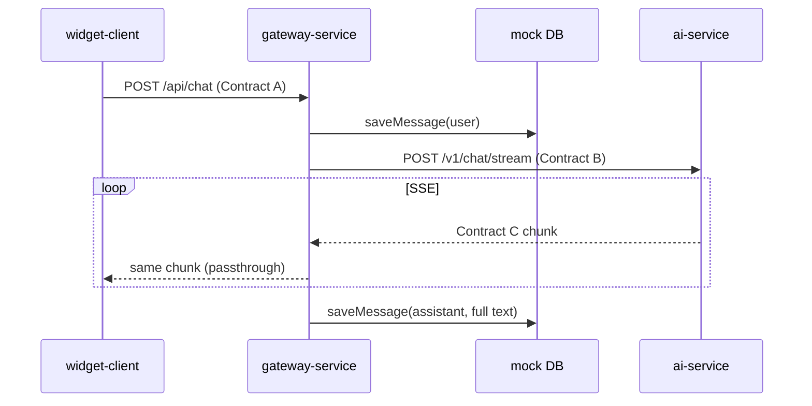

# Gateway Service

Next.js 16 API orchestration layer: **session tracking**, **mock persistence**, and **SSE stream proxying** between the widget and AI service. It does not import widget or AI code—only HTTP contracts.

## Role in the system



The gateway uses a **TransformStream** so bytes reach the widget immediately while a background task accumulates tokens and persists the full assistant reply when the stream ends.

---

## Tech stack

| Package | Version |
|---------|---------|
| Next.js | 16.1.4 |
| React | 19.0.0 |
| TypeScript | 5.7+ |
| Runtime | Edge (`export const runtime = "edge"`) |

Persistence is a **mock in-memory store** in `src/lib/db/schema.ts`, shaped like SQLite records for easy replacement.

---

## API reference

### `OPTIONS /api/chat`

CORS preflight for browser clients.

### `POST /api/chat`

**Contract A** — request:

```json
{
  "sessionId": "sess_123",
  "role": "reviewer",
  "message": "Check compliance."
}
```

| Field | Required | Values |
|-------|----------|--------|
| `sessionId` | yes | string |
| `role` | yes | `"user"` \| `"reviewer"` |
| `message` | yes | non-empty string |

**Response:** `200` with `Content-Type: text/event-stream` (Contract C passthrough from AI service).

**Errors:**

| Status | Cause |
|--------|-------|
| `400` | Invalid JSON or missing fields |
| `502` | AI service unreachable or error body |

**CORS (development):** `Access-Control-Allow-Origin: *` on stream responses.

---

## Contract translation

| Contract A (widget) | Contract B (AI) |
|---------------------|-----------------|
| `sessionId` | `conversation_id` |
| `role` | `role` |
| `message` | `query` |
| — | `context_history` (empty array today) |

Contract C is **not transformed**—chunks are forwarded as received.

---

## Project structure

```
gateway-service/
├── package.json
├── next.config.ts
└── src/
    ├── lib/
    │   ├── contracts.ts       # TypeScript contract types
    │   └── db/
    │       └── schema.ts      # saveMessage(), in-memory store
    └── app/
        ├── api/chat/route.ts  # Edge handler, TransformStream proxy
        ├── layout.tsx
        └── page.tsx           # Dev landing page
```

---

## Run locally

### Prerequisites

- Node.js 20+
- AI service running on port **8000**

### Install and start

```powershell
cd gateway-service
npm install
npm run dev
```

Server: [http://localhost:3000](http://localhost:3000)

### Production build

```powershell
npm run build
npm start
```

---

## Environment variables

| Variable | Default | Description |
|----------|---------|-------------|
| `AI_SERVICE_URL` | `http://localhost:8000/v1/chat/stream` | Contract B endpoint |

Set in `.env.local` for Next.js:

```env
AI_SERVICE_URL=http://localhost:8000/v1/chat/stream
```

---

## Persistence (mock)

`saveMessage(id, sessionId, role, content)` in `src/lib/db/schema.ts`:

- Generates IDs when `id` is empty
- Stores records in an in-memory array
- Called twice per chat turn: user message on request, assistant message after stream completes

**Swap for production:** Replace this file with real SQLite3, Drizzle, or Prisma—keep the function signature so `route.ts` stays unchanged.

Helper exports for debugging:

- `getMessagesBySession(sessionId)`
- `getAllMessages()`

---

## Stream proxy implementation

`src/app/api/chat/route.ts`:

1. Parse and validate Contract A
2. `saveMessage` for the user turn
3. `fetch` AI service with Contract B JSON
4. Pipe `aiResponse.body` through `TransformStream` to the client
5. Decode chunks in parallel to parse `data:` SSE lines
6. On completion, `saveMessage` for assembled assistant text

This satisfies both **low latency** (immediate passthrough) and **audit trail** (full reply saved at end).

---

## Edge runtime considerations

- Uses Web APIs (`fetch`, `TransformStream`, `TextDecoder`) compatible with Edge
- Local dev: `localhost:8000` is reachable from Next.js dev server
- Some hosted Edge environments restrict private network access—point `AI_SERVICE_URL` at a publicly reachable AI deployment in production

---

## Testing without the widget

```powershell
curl -X POST http://localhost:3000/api/chat `
  -H "Content-Type: application/json" `
  -H "Accept: text/event-stream" `
  -d '{"sessionId":"sess_test","role":"user","message":"Hello"}'
```

---

## Contracts (this module’s view)

| Direction | Contract | Endpoint |
|-----------|----------|----------|
| Inbound from widget | **A** | `POST /api/chat` |
| Outbound to AI | **B** | `AI_SERVICE_URL` |
| Inbound from AI / outbound to widget | **C** | SSE on `/api/chat` response |

Types live in `src/lib/contracts.ts`.

---

## Related documentation

- [Root README](../README.md) — full stack and all contracts
- [widget-client/README.md](../widget-client/README.md) — Contract A client
- [ai-service/README.md](../ai-service/README.md) — Contract B/C producer
