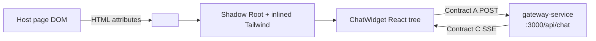

# Widget Client

Embeddable **Compliance Chat** UI packaged as a **Web Component** (`<compliance-chat-overlay>`) with **Shadow DOM** style isolation. Built with React 19, Zustand 5, and Tailwind CSS 3, compiled to a self-contained library bundle by Vite 6.

The widget talks to the gateway over **Contract A** and consumes **Contract C** SSE responses. It imports nothing from outside the `widget-client` folder.

---

## Role in the System



Styles inside the shadow tree do not leak to the host; host CSS does not pierce the widget (except inherited properties on `:host`, which are reset via `all: initial`).

---

## Tech Stack

| Package | Version |
|---------|---------|
| React | 19.0.0 |
| React DOM | 19.0.0 |
| Vite | 6.x |
| TypeScript | 5.7+ |
| Tailwind CSS | 3.4+ |
| Zustand | 5.x |
| Lucide React | latest |

---

## Web Component API

**Tag name:** `compliance-chat-overlay`

**Registration:** `src/mount.tsx` calls `customElements.define('compliance-chat-overlay', ...)`.

### HTML Attributes

| Attribute | Type | Required | Description |
|-----------|------|----------|-------------|
| `user-role` | `"user"` \| `"reviewer"` | **Yes** | Role set by the host application. Controls AI semantic routing and message bubble styling. **Read-only** from inside the widget — never toggled by UI interactions. |
| `user-id` | `string` | **Yes** | Unique identifier for the authenticated user (e.g. `"usr_abc123"`). Sent as `userId` in every Contract A request, stored in the Zustand store, and shown in the sidebar identity badge. |
| `gateway-url` | URL string | No | Override the Contract A endpoint. Default: `http://localhost:3000/api/chat` |
| `open` | `"true"` | No | If present and `"true"`, the chat panel opens immediately on mount. |
| `auth-token` | JWT string | No | Optional JWT Bearer token issued by your authentication provider. When provided, every Contract A POST includes an `Authorization: Bearer <token>` header. Required by the gateway when `REQUIRE_AUTH=true`. Omit entirely for dev/bypass mode. |

> **Important:** `user-role` and `user-id` are set by the **host application** and cannot be changed from inside the widget UI. Changing them via `setAttribute()` after mount is fully supported — `attributeChangedCallback` in `mount.tsx` propagates the new values into the Zustand store automatically.

---

## Embedding Guide

### Reviewer Role (most common in compliance apps)

```html
<!-- 1. Load the widget bundle -->
<script type="module" src="https://cdn.example.com/compliance-chat-overlay.es.js"></script>

<!-- 2. Mount the element -->
<compliance-chat-overlay
  gateway-url="https://api.example.com/api/chat"
  user-role="reviewer"
  user-id="usr_abc123"
  auth-token="<jwt-from-your-auth-provider>"
></compliance-chat-overlay>
```

### Standard User Role

```html
<compliance-chat-overlay
  gateway-url="https://api.example.com/api/chat"
  user-role="user"
  user-id="usr_xyz789"
  auth-token="<jwt-from-your-auth-provider>"
></compliance-chat-overlay>
```

### Open Panel on Page Load

```html
<compliance-chat-overlay
  gateway-url="https://api.example.com/api/chat"
  user-role="reviewer"
  user-id="usr_abc123"
  auth-token="<jwt-from-your-auth-provider>"
  open="true"
></compliance-chat-overlay>
```

### Dev / Bypass Mode (REQUIRE_AUTH=false on gateway)

When the gateway is running with `REQUIRE_AUTH=false`, you can omit `auth-token` entirely for local testing:

```html
<compliance-chat-overlay
  gateway-url="http://localhost:3000/api/chat"
  user-role="reviewer"
  user-id="dev_user_001"
></compliance-chat-overlay>
```

### Dynamic Attribute Updates (JavaScript)

```javascript
const widget = document.querySelector('compliance-chat-overlay');

// Switch user context at runtime (e.g. after re-authentication)
widget.setAttribute('user-id', 'usr_newuser');
widget.setAttribute('user-role', 'user');

// Update the auth token (e.g. after a token refresh)
widget.setAttribute('auth-token', '<refreshed-jwt>');

// Programmatically open or close
widget.setAttribute('open', 'true');
```

### Build Output Files

| File | Use case |
|------|----------|
| `dist/compliance-chat-overlay.es.js` | ES module — modern bundlers, CDN `<script type="module">` |
| `dist/compliance-chat-overlay.iife.js` | IIFE — plain `<script>` tag, no bundler required |

---

## UI Features

- **Floating launcher button** (bottom-right corner) — hidden when the panel is open.
- **Read-only role badge** in the panel header — shows the `user-role` attribute value; no manual toggle in the UI.
- **Chat History sidebar** — collapsible drawer listing past sessions with auto-generated titles and dates.
- **New Chat button** — available in the sidebar header and as a shortcut in the main header; archives the current session before creating a fresh one.
- **Session switching** — clicking a past session in the sidebar sets it as active and clears the message list (API hydration hook-ready).
- **Identity badge** — sidebar footer displays the current `user-id` and `user-role`.
- **Streaming message feed** — animated blinking cursor while the assistant is composing a reply.
- **Error banner** — displayed on gateway or network failures with the error message.
- **Input locked during streaming** — the send button and input field are disabled while an SSE stream is active, preventing double-sends.

---

## UX Improvements for Streaming Latency

With the new "Context Aggregator Pipeline" running on the backend, there is a natural latency before the first SSE token is streamed. To handle this gracefully, the UI features:

1. **Pre-Stream Loading Skeleton**: Before the first token arrives, an empty AI chat bubble appears containing a sleek, Tailwind-styled pulsing 3-dot skeleton. Once the backend begins streaming real text, the skeleton vanishes and the text streams naturally.
2. **Input Locking**: While the backend is fetching context and streaming its response (indicated by the `isStreaming` state in Zustand), both the text input and the "Send" button are fully disabled. They exhibit lowered opacity and a "not-allowed" cursor to clearly signal to the user that they must wait for the current response to complete.

Both of these features rely seamlessly on the centralized `isStreaming` boolean managed within `useChatStore`.

---

## State Architecture — Zustand (`src/store/useChatStore.ts`)

The entire widget state lives in a single flat Zustand store. There is no React Context, no prop drilling, and no external state management dependency beyond Zustand itself.

### Identity (set from HTML attributes)

| Field | Type | Set by | Description |
|-------|------|--------|-------------|
| `userId` | `string` | `initUser()` | Mirrors the `user-id` HTML attribute |
| `userRole` | `"user"` \| `"reviewer"` | `initUser()` | Mirrors the `user-role` HTML attribute |

### Widget Visibility

| Field | Type | Description |
|-------|------|-------------|
| `isOpen` | `boolean` | Controls panel visibility — toggled by the launcher button |

### Active Conversation

| Field | Type | Description |
|-------|------|-------------|
| `activeSessionId` | `string` | Current session ID sent as `sessionId` in Contract A requests |
| `messages` | `ChatMessage[]` | All messages for the active session, in order |
| `isStreaming` | `boolean` | Lock flag — `true` while an SSE stream is active |
| `error` | `string \| null` | Last client-side error message; `null` when clear |
| `gatewayUrl` | `string` | The Contract A endpoint (from `gateway-url` attribute) |

### Session History (sidebar)

| Field | Type | Description |
|-------|------|-------------|
| `sessions` | `ChatSession[]` | Past sessions, newest first |
| `isSidebarOpen` | `boolean` | Controls the history drawer visibility |

#### `ChatSession` type

```typescript
type ChatSession = {
  id: string;    // "sess_<timestamp>_<random>"
  title: string; // First 48 chars of the first user message
  date: string;  // ISO date string, e.g. "2026-06-03"
};
```

#### `ChatMessage` type

```typescript
type ChatMessage = {
  id: string;
  role: "user" | "reviewer" | "assistant";
  content: string;
  isStreaming?: boolean; // true while SSE tokens are still arriving
};
```

### Store Actions

| Action | Signature | Description |
|--------|-----------|-------------|
| `initUser` | `(id, role) => void` | Called once by `mount.tsx` after reading HTML attributes. Seeds `userId` and `userRole`. |
| `setGatewayUrl` | `(url) => void` | Updates the Contract A endpoint from the `gateway-url` attribute. |
| `toggleOpen` | `() => void` | Toggles panel visibility. |
| `setOpen` | `(bool) => void` | Explicitly open or close the panel. |
| `toggleSidebar` | `() => void` | Toggles the history sidebar drawer. |
| `setSidebarOpen` | `(bool) => void` | Explicitly open or close the sidebar. |
| `newSession` | `() => void` | Archives the current session into `sessions[]` (title = first user message, up to 48 chars), then creates a fresh `activeSessionId` and clears `messages`. |
| `setActiveSession` | `(sessionId) => void` | Sets `activeSessionId` and clears `messages`. This is the API integration point — add a `GET /api/chat/history/:sessionId` fetch here to hydrate messages. |
| `addUserMessage` | `(content) => string` | Appends a `{ role: userRole, content }` message; returns the generated ID. |
| `startAssistantMessage` | `() => string` | Appends an empty streaming assistant message; returns its ID. |
| `appendStreamToken` | `(token) => void` | Appends a token string to the last assistant message's `content`. |
| `finishStream` | `() => void` | Sets `isStreaming: false` on all messages; releases the streaming lock. |
| `setError` | `(msg \| null) => void` | Sets or clears the error banner. |
| `setStreaming` | `(bool) => void` | Manually controls the streaming lock. |
| `clearMessages` | `() => void` | Clears messages and generates a new session ID (used in dev). |

### Session History Flow

```
User clicks "New Chat" (or + icon)
        │
        ▼
newSession() is called
        │
        ├─ messages.length > 0?
        │    YES → title = first user message (≤ 48 chars + "…" if longer)
        │         → archived ChatSession prepended to sessions[]
        │    NO  → nothing archived (don't create empty session records)
        │
        └─ reset:
             activeSessionId = new generateSessionId()
             messages = []
             isSidebarOpen = false

User clicks a past session in the sidebar
        │
        ▼
setActiveSession(id)
        → activeSessionId = id
        → messages = []          ← cleared (API integration point)
        → isSidebarOpen = false
```

To hydrate messages for a past session from the gateway:

```typescript
// In your integration layer — call the gateway history endpoint
const res = await fetch(`http://localhost:3000/api/chat/history/${sessionId}`);
const { messages } = await res.json();
// Then populate the store with the returned messages
```

---

## SSE Stream Hook — `src/hooks/useChatStream.ts`

The `useChatStream` hook handles the full Contract A → Contract C lifecycle:

1. Reads `activeSessionId`, `userId`, `userRole`, and `gatewayUrl` from the Zustand store.
2. POSTs to `gatewayUrl` with the Contract A body: `{ sessionId, userId, role, message }`.
3. Reads the streaming response body with `response.body.getReader()` + `TextDecoder`.
4. Splits the decoded text on newlines and parses each `data: {...}` line.
5. On `type: "token"` → calls `appendStreamToken(content)`.
6. On `type: "done"` → calls `finishStream()`.
7. On `type: "error"` → calls `setError(content)`.
8. Network/fetch errors are caught and forwarded to `setError()`.

---

## Contract A — Outbound Request Shape

```http
POST http://localhost:3000/api/chat
Content-Type: application/json
Accept: text/event-stream
Authorization: Bearer <jwt>   ← included only when auth-token attribute is set

{
  "sessionId": "sess_1748956800_abc123",
  "userId": "usr_abc123",
  "role": "reviewer",
  "message": "Check Q2 compliance status."
}
```

`userId` comes from `useChatStore.userId` (set from `user-id` attribute).
`role` comes from `useChatStore.userRole` (set from `user-role` attribute).

> **Note:** When the gateway runs with `REQUIRE_AUTH=true`, the `Authorization` header is mandatory and `userId` in the body is ignored — the gateway extracts it from the verified JWT instead.

## Contract C — Inbound SSE Shape

```
data: {"type": "token", "content": "The Q2 "}
data: {"type": "token", "content": "status is fully compliant."}
data: {"type": "done"}
```

Error event:

```
data: {"type": "error", "content": "AI service unavailable"}
```

---

## Project Structure

```
widget-client/
├── index.html                  # Dev host page (mounts widget with all attributes)
├── vite.config.ts              # Dev server config + lib build output
├── tailwind.config.js          # ABB brand color tokens
├── postcss.config.js
└── src/
    ├── mount.tsx               # Web Component class — reads attributes, calls initUser()
    ├── index.css               # Tailwind directives + :host { all: initial }
    ├── store/
    │   └── useChatStore.ts     # Zustand store — identity, sessions, messages, actions
    ├── hooks/
    │   └── useChatStream.ts    # Contract A POST + Contract C SSE parsing
    └── components/
        └── ChatWidget.tsx      # Full panel UI: sidebar, message feed, input bar
```

---

## Shadow DOM and Styling

`mount.tsx` setup sequence:

1. `this.attachShadow({ mode: 'open' })` — creates an isolated DOM tree.
2. Injects a `<style>` element with compiled Tailwind CSS via `import tailwindStyles from './index.css?inline'`.
3. Mounts `<ChatWidget />` with `createRoot()` into the shadow root.

`:host { all: initial; }` in `index.css` resets all inherited host typography and layout properties to prevent visual bleed.

The sidebar drawer uses `absolute` positioning within the `overflow-hidden` panel container, so it never escapes the shadow boundary.

---

## Run Locally

### Prerequisites

- Node.js 20+
- `gateway-service` running on port **3000**
- `ai-service` running on port **8000** (accessed via gateway)

### Dev Server

```powershell
cd widget-client
npm install
npm run dev
```

Open [http://localhost:5173](http://localhost:5173). The dev `index.html` mounts the widget with:

```html
<compliance-chat-overlay
  gateway-url="http://localhost:3000/api/chat"
  user-role="reviewer"
  user-id="dev_user_001"
></compliance-chat-overlay>
```

To test the **user** role, edit `index.html` and change `user-role="user"`.

### Build Library Bundle

```powershell
npm run build
```

Output files are in `dist/`. Serve the IIFE or ES module build from your CDN or static host.

### Preview the Production Build

```powershell
npm run preview
```

---

## Customisation

**Safe to change without breaking contracts:**

- Color tokens in `tailwind.config.js` (`abb.primary`, `abb.dark`, `abb.surface`)
- Panel dimensions (`h-[560px] w-[400px]`) in `ChatWidget.tsx`
- Sidebar width (`w-64`) in `ChatWidget.tsx`
- Sidebar mock seed data in `buildMockSessions()` inside `useChatStore.ts`

**Do not change without coordinating with gateway and AI service:**

- POST body field names (`sessionId`, `userId`, `role`, `message`) — Contract A
- SSE event field names (`type`, `content`) — Contract C

---

## Troubleshooting

| Issue | Check |
|-------|-------|
| `user-role` not applied | Ensure attribute is set before element connects, or rely on `attributeChangedCallback` |
| Role shows `"user"` unexpectedly | Verify `user-role="reviewer"` is kebab-case |
| CORS error in console | Gateway is running and `gateway-url` attribute is correct |
| Stream never ends | AI service must emit a `{"type":"done"}` event to signal completion |
| Styles look unstyled | Build must inline CSS; verify `?inline` import in `mount.tsx` |
| 502 from fetch | Start AI service and gateway before the widget |
| Sidebar not visible | Intentional — `overflow-hidden` on the panel container clips the drawer |
| `userId` missing in gateway payload | Verify `user-id` attribute is set on the element |
| `401 Unauthorized` from gateway | Gateway has `REQUIRE_AUTH=true`. Either set `auth-token` on the element or set `REQUIRE_AUTH=false` for local testing. |
| Token rejected with "signature failed" | Verify the JWT was signed with the same `JWT_SECRET` configured in gateway `.env`. |

---

## Related Documentation

- [Root README](../README.md) — architecture, contracts, Master Boot Sequence
- [gateway-service/README.md](../gateway-service/README.md) — `/api/chat` and history API
- [ai-service/README.md](../ai-service/README.md) — semantic routing behind the gateway
