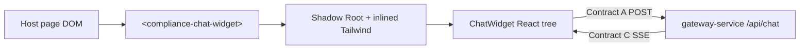

# Widget Client

Embeddable **Compliance Chat** UI packaged as a **Web Component** with **Shadow DOM** style isolation. Built with React 19, shipped via Vite. Talks only to the gateway over **Contract A** and consumes **Contract C** SSE—no AI or gateway code imports.

## Role in the system



Styles inside the shadow tree do not leak to the host; host CSS does not pierce the widget (except inherited properties on `:host` are reset).

---

## Tech stack

| Package | Version |
|---------|---------|
| React | 19.0.0 |
| React DOM | 19.0.0 |
| Vite | 6.x |
| TypeScript | 5.7+ |
| Tailwind CSS | 3.4+ |
| Zustand | 5.x |
| Lucide React | icons |

---

## Web Component API

**Tag name:** `compliance-chat-widget`

**Registration:** `src/mount.tsx` — `customElements.define('compliance-chat-widget', ...)`

### Attributes

| Attribute | Values | Description |
|-----------|--------|-------------|
| `gateway-url` | URL string | Contract A endpoint (default `http://localhost:3000/api/chat`) |
| `open` | `"true"` \| other | Open chat panel on connect when `"true"` |

### Example — development

```html
<compliance-chat-widget
  gateway-url="http://localhost:3000/api/chat"
></compliance-chat-widget>
<script type="module" src="/src/mount.tsx"></script>
```

### Example — production embed

```html
<script type="module" src="https://cdn.example.com/compliance-chat-widget.iife.js"></script>
<compliance-chat-widget gateway-url="https://api.example.com/api/chat"></compliance-chat-widget>
```

Build artifacts:

- `dist/compliance-chat-widget.es.js` — ES module
- `dist/compliance-chat-widget.iife.js` — script tag / legacy hosts

---

## UI features

- Floating launcher button (bottom-right)
- **User / Reviewer** role toggle (affects Contract A `role` and AI routing)
- Message feed with streaming cursor
- Input + send; disabled while streaming
- Error banner on gateway/network failures

---

## State and streaming

### Zustand — `src/store/useChatStore.ts`

| State | Description |
|-------|-------------|
| `isOpen` | Panel visibility |
| `activeRole` | `"user"` \| `"reviewer"` |
| `sessionId` | Auto-generated `sess_*` per session |
| `messages` | `{ id, role, content, isStreaming? }[]` |
| `isStreaming` | Lock input during SSE |
| `gatewayUrl` | Contract A base URL |
| `error` | Last client error message |

Actions: `addUserMessage`, `startAssistantMessage`, `appendStreamToken`, `finishStream`, etc.

### Hook — `src/hooks/useChatStream.ts`

1. POST Contract A to `gatewayUrl`
2. Read `response.body` with `getReader()` + `TextDecoder`
3. Parse lines starting with `data:`
4. On `type: "token"` → append to last assistant message
5. On `type: "done"` → `finishStream()`

---

## Contracts (this module’s view)

### Contract A — outbound

```json
{
  "sessionId": "sess_1700000000_abc123",
  "role": "reviewer",
  "message": "Check compliance."
}
```

Headers:

```
Content-Type: application/json
Accept: text/event-stream
```

### Contract C — inbound SSE

```text
data: {"type": "token", "content": "..."}
data: {"type": "done"}
```

Parsed in `useChatStream.ts` → `parseSseLine()`.

---

## Project structure

```
widget-client/
├── index.html              # Dev host page
├── vite.config.ts          # Dev server + lib build
├── tailwind.config.js
├── postcss.config.js
└── src/
    ├── mount.tsx           # Web Component + Shadow DOM
    ├── index.css           # Tailwind (inlined into shadow)
    ├── store/useChatStore.ts
    ├── hooks/useChatStream.ts
    └── components/ChatWidget.tsx
```

---

## Run locally

### Prerequisites

- Node.js 20+
- Gateway on port **3000**
- AI service on port **8000** (via gateway)

### Dev server

```powershell
cd widget-client
npm install
npm run dev
```

Open [http://localhost:5173](http://localhost:5173) (default Vite port).

1. Click the red chat bubble
2. Toggle **Reviewer** and send *"Check compliance."* to exercise the RAG path
3. Toggle **User** for the fast chat path

### Build library bundle

```powershell
npm run build
```

Output in `dist/`. Serve the IIFE or ES build from your CDN or static host.

### Preview production build

```powershell
npm run preview
```

---

## Shadow DOM and styling

`mount.tsx`:

1. `attachShadow({ mode: 'open' })`
2. Inject `<style>` with Tailwind compiled via `import tailwindStyles from './index.css?inline'`
3. `createRoot(mountPoint).render(<ChatWidget />)`

`:host { all: initial; }` in `index.css` reduces inherited host typography bleed.

---

## Customization without breaking contracts

Safe to change:

- Colors in `tailwind.config.js` (`abb.primary`, etc.)
- Copy, icons, layout in `ChatWidget.tsx`
- Default `gatewayUrl` in the store

Do **not** change without coordinating gateway + AI:

- POST body field names (Contract A)
- SSE `type` / `content` parsing (Contract C)

---

## Troubleshooting

| Issue | Check |
|-------|-------|
| CORS error | Gateway running; `gateway-url` correct |
| Stream never ends | AI service returning `done` event |
| Styles look unstyled | Build must inline CSS; use shadow mount path |
| 502 from fetch | Start AI + gateway before widget |

---

## Related documentation

- [Root README](../README.md) — architecture and full contract reference
- [gateway-service/README.md](../gateway-service/README.md) — `/api/chat` API
- [ai-service/README.md](../ai-service/README.md) — routing behind the gateway
