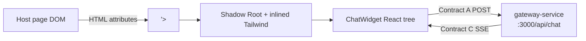

# Widget Client

Embeddable **Compliance Chat** UI packaged as a **Web Component** (`<compliance-chat-overlay>`) with **Shadow DOM** style isolation. Built with React 19, Zustand 5, and Tailwind CSS 3, compiled to a self-contained library bundle by Vite 6.

The widget talks to the gateway over **Contract A** and consumes **Contract C** SSE responses. It imports nothing from outside the `widget-client` folder.

---

## Role in the System



Styles inside the shadow tree do not leak to the host; host CSS does not pierce the widget (except inherited properties on `:host`, which are reset via `all: initial`).

---

## Tech Stack

| Package | Version |
|---------|---------|
| React | 19.0.0 |
| React DOM | 19.0.0 |
| Vite | 6.x |
| TypeScript | 5.7+ |
| Tailwind CSS | 3.4+ |
| Zustand | 5.x |
| Framer Motion | latest |
| Lucide React | latest |

---

## Environment Variables

| Variable | Default | Description |
|----------|---------|-------------|
| `VITE_GATEWAY_URL` | `http://localhost:3000` | The base URL of the Gateway Service. This is baked into the JavaScript bundle at build time by Vite. Always takes lower priority than the `gateway-url` HTML attribute. |

---

## Web Component API

**Tag name:** `compliance-chat-overlay`

**Registration:** `src/mount.tsx` calls `customElements.define('compliance-chat-overlay', ...)`.

### HTML Attributes

| Attribute | Type | Required | Description |
|-----------|------|----------|-------------|

| `gateway-url` | URL string | No | Override the Contract A endpoint. Default: `http://localhost:3000/api/chat` |
| `open` | `"true"` | No | If present and `"true"`, the chat panel opens immediately on mount. |
| `auth-token` | JWT string | No | Optional JWT Bearer token issued by your authentication provider. When provided, every Contract A POST includes an `Authorization: Bearer <token>` header. Required by the gateway when `REQUIRE_AUTH=true`. Omit entirely for dev/bypass mode. |
| `suggestions` | JSON string | No | Optional JSON-stringified array of strings to override the default Action Cards shown in the empty state. |


---

## Embedding Guide

### Reviewer Role (most common in compliance apps)

```html
<!-- 1. Load the widget bundle -->
<script type="module" src="https://cdn.example.com/compliance-chat-overlay.es.js"></script>

<!-- 2. Mount the element -->
<compliance-chat-overlay
  gateway-url="https://api.example.com/api/chat"
  user-role="reviewer"
  user-id="usr_abc123"
  auth-token="<jwt-from-your-auth-provider>"
  suggestions='["What is the VPN policy?", "Check server compliance", "Audit logs summary"]'
></compliance-chat-overlay>
```

### Standard User Role

```html
<compliance-chat-overlay
  gateway-url="https://api.example.com/api/chat"
  auth-token="<jwt-from-your-auth-provider>"
></compliance-chat-overlay>
```

### Open Panel on Page Load

```html
<compliance-chat-overlay
  gateway-url="https://api.example.com/api/chat"
  user-role="reviewer"
  user-id="usr_abc123"
  auth-token="<jwt-from-your-auth-provider>"
  open="true"
></compliance-chat-overlay>
```

### Dev / Bypass Mode (`REQUIRE_AUTH=false` on gateway)

```html
<compliance-chat-overlay
  gateway-url="http://localhost:3000/api/chat"
></compliance-chat-overlay>
```

### Dynamic Attribute Updates (JavaScript)

```javascript
const widget = document.querySelector('compliance-chat-overlay');


// Update the auth token (e.g. after a token refresh)
widget.setAttribute('auth-token', '<refreshed-jwt>');

// Programmatically open or close
widget.setAttribute('open', 'true');
```

### Build Output Files

| File | Use case |
|------|----------|
| `dist/compliance-chat-overlay.es.js` | ES module — modern bundlers, CDN `<script type="module">` |
| `dist/compliance-chat-overlay.iife.js` | IIFE — plain `<script>` tag, no bundler required |

---

## Bespoke UI Design Language

The widget features a high-end, bespoke enterprise design language that goes beyond a generic chat UI:

### Glassmorphism

The widget header and sidebar use **Enterprise Glassmorphism**: semi-transparent backgrounds (`bg-slate-900/90`) combined with a `backdrop-blur-md` blur effect, creating a modern layered depth. This is applied to both the main header bar and the collapsible session history drawer.

### Framer Motion Spring Animations

All interactive transitions are powered by **framer-motion** with spring physics:
- **Chat bubbles** pop in with a slight bounce (`type: "spring"`) on first render.
- **Sidebar** slides in/out smoothly as the drawer opens and closes.
- **Action Cards** stagger in with a cascading delay effect (`staggerChildren`) when the message list is empty.
- **Hover states** on buttons and session rows use `whileHover` scaling transforms.

### Custom Bespoke Scrollbar

The chat message feed and sidebar session list use **ultra-thin (5px) Corporate Red custom scrollbars** styled via webkit CSS. They appear as semi-transparent red pills.

The auto-expanding `<textarea>` carries the `no-scrollbar` utility class, suppressing the visible scrollbar on the input (`scrollbar-width: none` for Firefox; `::-webkit-scrollbar { display: none }` for Chrome/Safari/Edge) while still allowing internal overflow scrolling.

### Premium Iconography & Branding

- Solid, weighted **Phosphor-style** icons for a heavy, premium feel.
- Custom sophisticated **"Compliance Assistant" SVG shield** in the header.
- **Corporate Red** (`#D71920`) accent palette throughout.
- **Layered 3D depth** — chat bubbles and Action Cards use subtle shadows and borders.
- **Sleek dark tooltips** on icon buttons that fade in after a 500ms hover delay.

---

## System Status Engine

On mount, `ChatWidget` calls `initializeSystem()` exactly **once**. This runs a `Promise.allSettled` against **two** gateway endpoints concurrently:

| Probe | Endpoint | Verifies |
|---|---|---|
| Database | `GET /api/chat/history?userId=…` | Gateway + Postgres connectivity; also hydrates the session sidebar |
| AI service | `GET /api/health` | AI microservice liveness (via gateway proxy) |

Both requests include the `Authorization: Bearer <token>` header when `auth-token` is present.

### Evaluation Logic

The UI is only `"online"` if **both** probes return `200 OK`. The history probe's `401` status is checked first, before the general failure condition.

| Condition | `systemStatus` |
|---|---|
| History probe returns `401` | `"unauthorized"` — checked first, before any other condition |
| Either probe fails (network error, `5xx`) | `"offline"` |
| **Both** probes return `200 OK` | `"online"` — sessions hydrated from history response |
| Before probes complete | `"connecting"` (default on load) |

### UI Effects Per Status

| `systemStatus` | Header dot | Input placeholder | Input / send enabled |
|---|---|---|---|
| `connecting` | Pulsing **amber** | "Connecting to Compliance Assistant..." | No |
| `online` | Pulsing **green** | "Type your question..." | Yes (unless streaming) |
| `unauthorized` | Solid **red** | "Chat disabled: Authentication failed." | No |
| `offline` | Solid **red** | "Service temporarily unavailable." | No |

---

## Identity — JWT Display Name Extraction

When the `auth-token` HTML attribute is set, the Web Component decodes the JWT **payload** (middle segment) using standard Base64 decoding — **no external JWT library required**.

**Implementation:** `src/utils/jwt.ts` — `decodeJwtPayload()` and `extractUserNameFromJwt()`

The decoded JSON is scanned for a display name in this priority order:

1. `name`
2. `userName`
3. `userId`
4. `sub`

The first string value found is stored in the Zustand `userName` field via `setAuthToken()`. This name is shown:

- In the **sidebar identity badge** (replacing "Anonymous" / "User" hardcoded defaults)
- As the **sender label** on human message bubbles (fallback: **"You"**)

> **Security note:** Payload decoding is for **display only**. Authentication is enforced by the gateway when verifying the Bearer token on each request.

---

## Interaction Logic

### Auto-Expanding Textarea

The chat input is a `<textarea>` (not `<input>`) that:

- **Auto-expands** from 1 line up to a maximum of 150px as the user types, by setting `height: auto` then measuring `scrollHeight` on each `input` event.
- **Submits** on **Enter** (sends message).
- **Inserts a newline** on **Shift+Enter** (multi-line entry).
- Displays a subtle **Corporate Red focus glow** when active.
- Carries the `no-scrollbar` class to suppress the visual scrollbar while keeping internal overflow scrolling.

### Staggered Action Cards

When `messages.length === 0`, three compact pill-shaped **Action Cards** animate into view using Framer Motion's `staggerChildren` (`staggerDelay: 0.1s`). Each card presents a pre-written compliance question. Clicking a card immediately calls `sendMessage()` with that text — the interaction is identical to typing and pressing Enter.

### Intelligent Auto-Scroll

Powered by `useLayoutEffect` (fires synchronously after each DOM paint), four distinct triggers ensure the user never loses the AI response:

| Trigger | Scroll behaviour |
|---------|-----------------|
| **Streaming token** | `behavior: 'auto'` — instant snap to bottom on every new token (prevents jitter during rapid streaming) |
| **Message complete** | `behavior: 'smooth'` — smooth scroll once `isStreaming` transitions to `false` |
| **History load** | `requestAnimationFrame(scrollToBottomInstant)` — immediate scroll on the next animation frame after a past session is loaded from the API |
| **Send** | `requestAnimationFrame(scrollToBottomInstant)` — called before the stream is awaited, so the user's own message and the loading skeleton are always visible |

A floating **chevron-down button** slides in from the bottom-right when the user manually scrolls more than **200px above the bottom**. Clicking it performs a smooth scroll back to the newest message and the button disappears.

---

## UX Improvements for Streaming Latency

With the Context Aggregator Pipeline running on the backend, there is a natural latency before the first SSE token arrives (guardrail + extractor run first). To handle this gracefully:

1. **Pre-Stream Loading Skeleton** — Before the first token arrives, an empty AI chat bubble appears containing a sleek, Tailwind-styled pulsing 3-dot skeleton. Once the backend begins streaming real text, the skeleton vanishes and text streams naturally.
2. **Input Locking** — While `isStreaming` is `true` in Zustand, both the text input and the "Send" button are fully disabled, with lowered opacity and a `cursor-not-allowed` style.

---

## SSE Stream Hook — `src/hooks/useChatStream.ts`

The `useChatStream` hook handles the full Contract A → Contract C lifecycle:

1. Reads `activeSessionId`, `userId`, `userRole`, `gatewayUrl`, and `authToken` from the Zustand store.
2. POSTs to `gatewayUrl` with the Contract A body: `{ sessionId, userId, role, message }`.
3. Attaches `Authorization: Bearer <token>` header only when `authToken` is present.
4. Reads the streaming response body with `response.body.getReader()` + `TextDecoder`.
5. Splits the decoded text on newlines and parses each `data: {...}` line.
6. On `type: "token"` → calls `appendStreamToken(content)`.
7. On `type: "sources"` → calls `setStreamSources(content)` — attaches the citation array to the current assistant message.
8. On `type: "done"` → calls `finishStream()`.
9. On `type: "error"` → checks for `/unauthorized/i` in the content and throws a user-friendly auth error; otherwise throws the raw content.
10. Network/fetch errors are caught, formatted by `apiError.ts`, and forwarded to `setError()`.

---

## Contract A — Outbound Request Shape

```http
POST http://localhost:3000/api/chat
Content-Type: application/json
Accept: text/event-stream
Authorization: Bearer <jwt>   ← included only when auth-token attribute is set

{
  "sessionId": "sess_1748956800_abc123",
  "userId": "dev_user_001",
  "message": "Check Q2 compliance status."
}
```

`sessionId` comes from `useChatStore.activeSessionId`.
`userId` is dynamically extracted from the `auth-token` payload if present, falling back to `"dev_user_001"` for local dev bypass mode.

> **Note:** When the gateway runs with `REQUIRE_AUTH=true`, the `Authorization` header is mandatory and `userId` in the body is ignored — the gateway extracts it from the verified JWT instead.

## Contract C — Inbound SSE Shape

Standard RAG response with optional citations:

```
data: {"type": "token", "content": "The Q2 "}
data: {"type": "token", "content": "status is fully compliant."}
data: {"type": "sources", "content": ["ISO_9001_Policy.pdf", "Q2_Audit_Report.pdf"]}
data: {"type": "done"}
```

The `sources` event is **optional**. When absent (e.g. for general chat responses or when `ENABLE_CITATIONS=false`), no citation pills are rendered.

Error event:

```
data: {"type": "error", "content": "AI service unavailable"}
```

---

## State Architecture — Zustand (`src/store/useChatStore.ts`)

The entire widget state lives in a single flat Zustand store. No React Context, no prop drilling.

### Identity (set from HTML attributes)

| Field | Type | Set by | Description |
|-------|------|--------|-------------|

| `userName` | `string \| null` | `setAuthToken()` | Display name extracted from JWT payload; `null` when no token or no name claim |
| `authToken` | `string \| null` | `setAuthToken()` | Raw JWT from the `auth-token` HTML attribute |

### Widget Visibility

| Field | Type | Description |
|-------|------|-------------|
| `isOpen` | `boolean` | Controls panel visibility |

### Active Conversation

| Field | Type | Description |
|-------|------|-------------|
| `activeSessionId` | `string` | Current session ID sent as `sessionId` in Contract A requests |
| `messages` | `ChatMessage[]` | All messages for the active session, in order |
| `isStreaming` | `boolean` | Lock flag — `true` while an SSE stream is active |
| `error` | `string \| null` | Last client-side error message; `null` when clear |
| `gatewayUrl` | `string` | The Contract A endpoint (from `gateway-url` attribute) |

### Session History (sidebar)

| Field | Type | Description |
|-------|------|-------------|
| `sessions` | `ChatSession[]` | Past sessions, newest first |
| `isSidebarOpen` | `boolean` | Controls the history drawer visibility |
| `systemStatus` | `"connecting"` \| `"online"` \| `"offline"` \| `"unauthorized"` | Aggregated gateway + AI availability; drives header dot and input lock. Defaults to `"connecting"`. |

#### `ChatSession` type

```typescript
type ChatSession = {
  id: string;           // "sess_<timestamp>_<random>"
  title: string | null; // User-set name, or null if not yet named; display falls back to "New Chat"
  date: string;         // ISO date string "2026-06-03" — used for sidebar date grouping
  updatedAt: string;    // Full ISO timestamp of last activity
};
```

#### `ChatMessage` type

```typescript
type ChatMessage = {
  id: string;
  role: "user" | "assistant";
  content: string;
  isStreaming?: boolean; // true while SSE tokens are still arriving
  sources?: string[];   // RAG citation filenames — populated by the Contract C `sources` event
  timestamp?: string;   // Locale time string, e.g. "10:30 AM"
};
```

### Store Actions

| Action | Signature | Description |
|--------|-----------|-------------|

| `setGatewayUrl` | `(url) => void` | Updates the Contract A endpoint from the `gateway-url` attribute. |
| `setAuthToken` | `(token \| null) => void` | Stores the JWT and decodes `userName` from its payload via `extractUserNameFromJwt()`. |
| `toggleOpen` | `() => void` | Toggles panel visibility. |
| `setOpen` | `(bool) => void` | Explicitly open or close the panel. |
| `toggleSidebar` | `() => void` | Toggles the history sidebar drawer. |
| `setSidebarOpen` | `(bool) => void` | Explicitly open or close the sidebar. |
| `newSession` | `() => void` | Creates a fresh `activeSessionId` and clears `messages`. Does **not** archive an empty session (guards against ghost entries). |
| `setActiveSession` | `(sessionId) => void` | Sets `activeSessionId` and clears `messages` without fetching from the API. |
| `loadSession` | `(sessionId) => Promise<void>` | Alias for `fetchSessionMessages` — fetches messages for a session. |
| `fetchSessionMessages` | `(sessionId) => Promise<void>` | Fetches `GET /api/chat/history/:sessionId?userId=…`, hydrates `messages`, sets `activeSessionId`. |
| `loadSessions` | `(userId) => Promise<void>` | Fetches `GET /api/chat/history?userId=…` and hydrates the `sessions` sidebar list. |
| `fetchHistory` | `() => Promise<void>` | Calls `loadSessions` for the current `userId` (reads from store). |
| `initializeSystem` | `() => Promise<void>` | Dual health check on mount: `GET /api/chat/history` + `GET /api/health`. Sets `systemStatus` and hydrates `sessions` when both succeed. |
| `renameSession` | `(sessionId, newTitle) => Promise<void>` | **Optimistically** updates the local `sessions` array then PATCHes `PATCH /api/chat/history/:sessionId`. Rolls back and sets `error` on failure. |
| `addUserMessage` | `(content) => string` | Appends a `{ role: "user", content, timestamp }` message and upserts the session into the sidebar list; returns the generated ID. |
| `startAssistantMessage` | `() => string` | Appends an empty streaming assistant message with `isStreaming: true`; returns its ID. |
| `appendStreamToken` | `(token) => void` | Appends a token string to the last assistant message's `content`. |
| `setStreamSources` | `(sources: string[]) => void` | Attaches RAG citation filenames to the currently-streaming assistant message. Called when the Contract C `sources` SSE event is received. |
| `finishStream` | `() => void` | Sets `isStreaming: false` on all messages; releases the streaming lock. |
| `setError` | `(msg \| null) => void` | Sets or clears the error banner. |
| `setStreaming` | `(bool) => void` | Manually controls the streaming lock. |
| `clearMessages` | `() => void` | Clears messages and generates a new session ID. |

### Session History Flow

```
User clicks "New Chat" (or + icon)
        │
        ▼
newSession() is called
        │
        └─ reset:
             activeSessionId = new generateSessionId()  ("sess_<ts>_<rand>")
             messages = []
             isStreaming = false
             error = null
             isSidebarOpen = false

User sends first message in a new session
        │
        ▼
addUserMessage(content) called
        │
        └─ upsertSessionOnMessage() runs:
             session not in sessions[] yet?
               → create: { id, title: content.slice(0, 48) + "…", date, updatedAt }
               → prepend to sessions[]
             session already in sessions[]?
               → update updatedAt and date, move to front

User clicks a past session in the sidebar
        │
        ▼
loadSession(id)         ← fetches GET /api/chat/history/:sessionId
        → activeSessionId = id
        → messages populated from API response
        → isSidebarOpen = false

User hovers a session row → pencil icon appears
        │
        ▼
User clicks pencil → title text becomes <input> (inline)
        │
        ├─ User presses Enter or clicks away (blur)
        │        → renameSession(id, newTitle) called
        │        → optimistic local update applied immediately
        │        → PATCH /api/chat/history/:sessionId { title }
        │        → on error: rollback + error banner
        │
        └─ User presses Escape
                 → input dismissed, no save
```

---

## Sidebar Date Grouping

The `ChatSidebar` component groups sessions into sections using the `date` field (ISO date string, `"YYYY-MM-DD"`) on each `ChatSession`:

| Section | Condition |
|---|---|
| **Today** | `session.date === today` |
| **Previous 7 Days** | `session.date >= (today − 7 days)` and not today |
| **Older** | Everything else |

The `groupSessionsByDate()` helper function performs this bucketing. Sections with zero sessions are **omitted entirely** — no empty headings are rendered.

---

## Inline Session Rename

Every session row in the sidebar has a hover-revealed pencil (✏️) icon. The interaction is handled by the `SessionItem` component:

1. **Hover** the row → `<Pencil />` icon fades in (via Tailwind `invisible group-hover/item:visible`).
2. **Click pencil** → title `<p>` swaps out for a transparent `<input>` pre-filled with the current title (or blank if it was `"New Chat"`).
3. **Commit** via **Enter** or **blur** → calls `renameSession(id, newTitle)` in the Zustand store:
   - Immediate **optimistic update** in the local `sessions[]` array.
   - **PATCH** `{gatewayBase}/api/chat/history/:sessionId` with `{ title: newTitle }`.
   - On failure: the previous sessions array is restored and `error` is set (error banner shown).
4. **Cancel** via **Escape** → input dismissed, no network request, title unchanged.

> If the submitted value is blank or unchanged, `renameSession` is not called.

---

## Shadow DOM and Styling

`mount.tsx` setup sequence:

1. `this.attachShadow({ mode: 'open' })` — creates an isolated DOM tree.
2. Injects a `<style>` element with compiled Tailwind CSS via `import tailwindStyles from './index.css?inline'`.
3. Mounts `<ChatWidget />` with `createRoot()` into the shadow root.

`:host { all: initial; }` in `index.css` resets all inherited host typography and layout properties to prevent visual bleed.

The sidebar drawer uses `absolute` positioning within the `overflow-hidden` panel container, so it never escapes the shadow boundary.

---

## Run Locally

### Prerequisites

- Node.js 20+
- `gateway-service` running on port **3000**
- `ai-service` running on port **8000** (accessed via gateway)

### Dev Server

```powershell
cd widget-client
npm install
npm run dev
```

Open [http://localhost:5173](http://localhost:5173). The dev `index.html` mounts the widget with:

```html
<compliance-chat-overlay
  gateway-url="http://localhost:3000/api/chat"
></compliance-chat-overlay>
```


### Build Library Bundle

```powershell
npm run build
```

Output files are in `dist/`. Serve the IIFE or ES module build from your CDN or static host.

### Preview the Production Build

```powershell
npm run preview
```

---

## Project Structure

```
widget-client/
├── index.html                  # Dev host page (mounts widget with all attributes)
├── vite.config.ts              # Dev server config + lib build output
├── tailwind.config.js          # ABB brand color tokens
├── postcss.config.js
└── src/
    ├── mount.tsx               # Web Component class — reads attributes, calls initUser() + setAuthToken()
    ├── index.css               # Tailwind directives + :host { all: initial } + custom scrollbar styles
    ├── store/
    │   └── useChatStore.ts     # Zustand store — identity, sessions, messages, all actions
    ├── utils/
    │   ├── jwt.ts              # JWT payload Base64 decode + display name extraction
    │   └── apiError.ts         # Human-readable error formatting (401 → auth error message)
    ├── hooks/
    │   └── useChatStream.ts    # Contract A POST + Contract C SSE parsing
    └── components/
        └── ChatWidget.tsx      # Full panel UI: sidebar, message feed, input bar, action cards
```

---

## Customisation

**Safe to change without breaking contracts:**

- Color tokens in `tailwind.config.js` (`abb.primary`, `abb.dark`, `abb.surface`)
- Panel dimensions (`h-[560px] w-[400px]`) in `ChatWidget.tsx`
- Sidebar width (`w-64`) in `ChatWidget.tsx`

**Do not change without coordinating with gateway and AI service:**

- POST body field names (`sessionId`, `userId`, `message`) — Contract A
- SSE event field names (`type`, `content`) — Contract C

---

## Troubleshooting

| Issue | Check |
|-------|-------|

| CORS error in console | Gateway is running and `gateway-url` attribute is correct |
| Stream never ends | AI service must emit a `{"type":"done"}` event to signal completion |
| Styles look unstyled | Build must inline CSS; verify `?inline` import in `mount.tsx` |
| `502` from fetch | Start AI service and gateway before the widget |
| Sidebar not visible | Intentional — `overflow-hidden` on the panel container clips the drawer until opened |

| `401 Unauthorized` from gateway | Gateway has `REQUIRE_AUTH=true`. Either set `auth-token` on the element or set `REQUIRE_AUTH=false` for local testing. |
| Token rejected with "signature failed" | Verify the JWT was signed with the same `JWT_SECRET` configured in gateway `.env`. |
| Citation pills not appearing | Verify the AI service has `ENABLE_CITATIONS=true` and that a ChromaDB-backed RAG query was made (general chat queries do not emit a `sources` event). |
| Status stuck on "connecting" | Both `GET /api/chat/history` AND `GET /api/health` must return `200`. Check both services are running. |
| Rename fails with `404`/`405` | The gateway `PATCH /api/chat/history/:sessionId` endpoint is not deployed. UI automatically rolls back the optimistic title update and shows an error banner. |
| Rename rolls back immediately | Check the gateway console for the PATCH response status. If `REQUIRE_AUTH=true`, ensure `auth-token` is set and valid. |

---

## Related Documentation

- [Root README](../README.md) — architecture, contracts, Master Boot Sequence
- [gateway-service/README.md](../gateway-service/README.md) — `/api/chat` and history API
- [ai-service/README.md](../ai-service/README.md) — semantic routing behind the gateway
