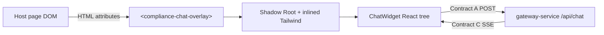

# Widget Client

Embeddable **Compliance Chat** UI packaged as a **Web Component** (`<compliance-chat-overlay>`) with **Shadow DOM** style isolation. Built with React 19, Zustand 5, and Tailwind CSS 3 — shipped as a self-contained library bundle via Vite.

The widget talks to the gateway over **Contract A** and consumes streaming **Contract C** SSE responses. It imports nothing from outside the `widget-client` folder.

---

## Role in the System



Styles inside the shadow tree do not leak to the host; host CSS does not pierce the widget (except inherited properties on `:host` are reset via `all: initial`).

---

## Tech Stack

| Package        | Version |
|----------------|---------|
| React          | 19.0.0  |
| React DOM      | 19.0.0  |
| Vite           | 6.x     |
| TypeScript     | 5.7+    |
| Tailwind CSS   | 3.4+    |
| Zustand        | 5.x     |
| Lucide React   | icons   |

---

## Web Component API

**Tag name:** `compliance-chat-overlay`

**Registration:** `src/mount.tsx` — `customElements.define('compliance-chat-overlay', ...)`

### HTML Attributes

| Attribute     | Type                        | Required | Description                                                                 |
|---------------|-----------------------------|----------|-----------------------------------------------------------------------------|
| `user-role`   | `"user"` \| `"reviewer"`   | **Yes**  | Role injected by the host. Controls AI routing and message styling. Never toggled from within the widget. |
| `user-id`     | string                      | **Yes**  | Unique identifier for the authenticated user (e.g. `"usr_abc123"`). Sent with every request via the Zustand store and shown in the sidebar identity badge. |
| `gateway-url` | URL string                  | No       | Override the Contract A endpoint (default: `http://localhost:3000/api/chat`). |
| `open`        | `"true"` \| _(any)_        | No       | If `"true"`, the chat panel opens immediately on mount.                    |

> **Important:** `user-role` and `user-id` are **read-only from the widget's perspective**. They are set by the host application and cannot be changed from inside the widget UI. Changing them via `setAttribute()` after mount is fully supported — `attributeChangedCallback` propagates the new value into the Zustand store automatically.

### Embedding — Quick Start

```html
<!-- 1. Load the widget bundle -->
<script type="module" src="https://cdn.example.com/compliance-chat-overlay.es.js"></script>

<!-- 2. Place the element with the required attributes -->
<compliance-chat-overlay
  gateway-url="https://api.example.com/api/chat"
  user-role="reviewer"
  user-id="usr_abc123"
></compliance-chat-overlay>
```

### Embedding — User Role

```html
<compliance-chat-overlay
  gateway-url="https://api.example.com/api/chat"
  user-role="user"
  user-id="usr_xyz789"
></compliance-chat-overlay>
```

### Embedding — Open on Load

```html
<compliance-chat-overlay
  gateway-url="https://api.example.com/api/chat"
  user-role="reviewer"
  user-id="usr_abc123"
  open="true"
></compliance-chat-overlay>
```

### Dynamic Attribute Update (JavaScript)

```javascript
const widget = document.querySelector('compliance-chat-overlay');

// Switch user context at runtime (e.g. after re-authentication)
widget.setAttribute('user-id', 'usr_newuser');
widget.setAttribute('user-role', 'user');

// Programmatically open/close
widget.setAttribute('open', 'true');
```

### Build Output

| File                                  | Use case                         |
|---------------------------------------|----------------------------------|
| `dist/compliance-chat-overlay.es.js`  | ES module — modern bundlers/CDN  |
| `dist/compliance-chat-overlay.iife.js`| IIFE — plain `<script>` tag      |

---

## UI Features

- **Floating launcher button** (bottom-right) — hidden when `open="true"`.
- **Read-only role badge** in the header — shows the role from the `user-role` attribute; no manual toggle.
- **Chat History sidebar** — collapsible drawer listing past sessions with titles and dates.
- **New Chat button** — in the sidebar and as a header shortcut; archives the current session.
- **Session switching** — clicking a past session sets it as active (API hydration hook-ready).
- **Identity badge** — sidebar footer shows `user-id` and `user-role`.
- **Streaming message feed** — animated cursor while assistant is composing.
- **Error banner** — shown on gateway/network failures.
- **Input disabled during streaming** — prevents double-sends.

---

## State Architecture — Zustand (`src/store/useChatStore.ts`)

### Identity (set from HTML attributes)

| Field      | Type                       | Set by            | Description                                 |
|------------|----------------------------|-------------------|---------------------------------------------|
| `userId`   | `string`                   | `initUser()`      | Mirrors the `user-id` HTML attribute        |
| `userRole` | `"user"` \| `"reviewer"`  | `initUser()`      | Mirrors the `user-role` HTML attribute      |

### Widget Visibility

| Field    | Type      | Description              |
|----------|-----------|--------------------------|
| `isOpen` | `boolean` | Controls panel visibility |

### Active Conversation

| Field             | Type            | Description                                      |
|-------------------|-----------------|--------------------------------------------------|
| `activeSessionId` | `string`        | Current session ID (sent in Contract A request) |
| `messages`        | `ChatMessage[]` | Messages for the active session                 |
| `isStreaming`     | `boolean`       | Lock during SSE                                  |
| `error`           | `string\|null`  | Last client error                                |
| `gatewayUrl`      | `string`        | Contract A endpoint                              |

### Session History (sidebar)

| Field           | Type            | Description                                                          |
|-----------------|-----------------|----------------------------------------------------------------------|
| `sessions`      | `ChatSession[]` | Ordered list of past sessions (newest first)                         |
| `isSidebarOpen` | `boolean`       | Controls the history drawer                                          |
| `activeSessionId` | `string`      | ID of the currently selected session                                 |

#### `ChatSession` shape

```typescript
type ChatSession = {
  id: string;    // "sess_<timestamp>_<random>"
  title: string; // Derived from the first user message (up to 48 chars)
  date: string;  // ISO date, e.g. "2026-06-03"
};
```

### Actions

| Action                   | Description                                                                                               |
|--------------------------|-----------------------------------------------------------------------------------------------------------|
| `initUser(id, role)`     | Called by `mount.tsx` after reading `user-id` and `user-role` attributes. Seeds `userId` + `userRole`.  |
| `setGatewayUrl(url)`     | Updates the Contract A endpoint.                                                                          |
| `toggleOpen()`           | Toggles the chat panel.                                                                                   |
| `setOpen(bool)`          | Explicitly open or close the panel.                                                                       |
| `toggleSidebar()`        | Toggles the history sidebar.                                                                              |
| `setSidebarOpen(bool)`   | Explicitly open or close the sidebar.                                                                     |
| `newSession()`           | Archives the current session into `sessions[]` (using the first user message as title), then creates a fresh `activeSessionId` and clears `messages`. |
| `setActiveSession(id)`   | Sets `activeSessionId` and clears `messages` (future API integration should load messages here).         |
| `addUserMessage(text)`   | Appends a user message; role is taken from `userRole` in the store.                                      |
| `startAssistantMessage()`| Appends an empty streaming assistant message.                                                             |
| `appendStreamToken(tok)` | Appends a token to the last assistant message.                                                            |
| `finishStream()`         | Marks all streaming messages as done; clears `isStreaming`.                                               |
| `setError(msg)`          | Stores an error string (or clears with `null`).                                                           |
| `setStreaming(bool)`     | Manually sets the streaming lock.                                                                         |

### Session History Flow

```
User sends first message
        │
        ▼
newSession() triggered (+ icon or sidebar button)
        │
        ├─ messages.length > 0?
        │    YES → derive title from first user message
        │         → prepend ChatSession to sessions[]
        │    NO  → skip archiving (empty session)
        │
        └─ reset: activeSessionId = new ID, messages = [], close sidebar
```

When the user **clicks a past session** in the sidebar:

```
setActiveSession(id)
  → activeSessionId = id
  → messages = []          ← cleared; API integration point
  → isSidebarOpen = false
```

**To hydrate messages for a past session**, subscribe to `activeSessionId` changes and fetch from your API, then call the appropriate store actions (or extend the store with a `setMessages` action).

---

## Hook — `src/hooks/useChatStream.ts`

1. Reads `activeSessionId`, `userRole`, and `gatewayUrl` from the store.
2. POSTs to `gatewayUrl` (Contract A) with `{ sessionId, role, message }`.
3. Streams the response body with `getReader()` + `TextDecoder`.
4. Parses `data:` lines (Contract C SSE).
5. On `type: "token"` → `appendStreamToken(content)`.
6. On `type: "done"` → `finishStream()`.
7. On `type: "error"` → throws, caught by error handler → `setError()`.

---

## Contracts

### Contract A — outbound POST

```http
POST <gateway-url>
Content-Type: application/json
Accept: text/event-stream

{
  "sessionId": "sess_1748956800_abc123",
  "role": "reviewer",
  "message": "Check Q2 compliance status."
}
```

`role` comes directly from `userRole` in the store (injected via `user-role` attribute).

### Contract C — inbound SSE

```text
data: {"type": "token", "content": "The "}
data: {"type": "token", "content": "status is..."}
data: {"type": "done"}
```

Error event:

```text
data: {"type": "error", "content": "AI service unavailable"}
```

---

## Project Structure

```
widget-client/
├── index.html                  # Dev host page (uses new tag + all attributes)
├── vite.config.ts              # Dev server + lib build
├── tailwind.config.js          # ABB color tokens
├── postcss.config.js
└── src/
    ├── mount.tsx               # Web Component — reads attrs, calls initUser()
    ├── index.css               # Tailwind + :host { all: initial }
    ├── store/
    │   └── useChatStore.ts     # Zustand — identity, sessions, messages
    ├── hooks/
    │   └── useChatStream.ts    # SSE fetch + stream parsing
    └── components/
        └── ChatWidget.tsx      # Panel, sidebar, message feed, input bar
```

---

## Run Locally

### Prerequisites

- Node.js 20+
- Gateway running on port **3000**
- AI service on port **8000** (via gateway)

### Dev Server

```powershell
cd widget-client
npm install
npm run dev
```

Open [http://localhost:5173](http://localhost:5173). The dev host page (`index.html`) mounts the widget with:

```html
<compliance-chat-overlay
  gateway-url="http://localhost:3000/api/chat"
  user-role="reviewer"
  user-id="dev_user_001"
></compliance-chat-overlay>
```

To test the **user** role, edit `index.html` and change `user-role="user"`.

### Build Library Bundle

```powershell
npm run build
```

Output in `dist/`. Serve the IIFE or ES build from your CDN or static host.

### Preview Production Build

```powershell
npm run preview
```

---

## Shadow DOM and Styling

`mount.tsx` setup:

1. `attachShadow({ mode: 'open' })` — creates an isolated tree.
2. Injects `<style>` containing compiled Tailwind via `import tailwindStyles from './index.css?inline'`.
3. Mounts `<ChatWidget />` via `createRoot()`.

`:host { all: initial; }` in `index.css` resets inherited host typography to prevent bleed.

The sidebar drawer uses `absolute` positioning within the `overflow-hidden` panel container — it never escapes the shadow boundary.

---

## Customization

Safe to change without breaking contracts:

- Colors in `tailwind.config.js` (`abb.primary`, `abb.dark`, `abb.surface`)
- Panel dimensions (`h-[560px] w-[400px]`) in `ChatWidget.tsx`
- Sidebar width (`w-64`) in `ChatWidget.tsx`
- Mock seed sessions in `buildMockSessions()` inside `useChatStore.ts`

**Do not change** without coordinating with gateway + AI:

- POST body field names (`sessionId`, `role`, `message`) — Contract A
- SSE `type` / `content` field names — Contract C

---

## Troubleshooting

| Issue                           | Check                                                         |
|---------------------------------|---------------------------------------------------------------|
| `user-role` not applied         | Ensure attribute is set **before** the element connects, or rely on `attributeChangedCallback` |
| Role shows `"user"` unexpectedly | Verify `user-role="reviewer"` is spelled correctly (kebab-case) |
| CORS error                      | Gateway running; `gateway-url` correct                        |
| Stream never ends               | AI service returning `done` event                             |
| Styles look unstyled            | Build must inline CSS; verify shadow mount path               |
| 502 from fetch                  | Start AI + gateway before the widget                          |
| Sidebar not visible             | Check `overflow-hidden` on the panel container (intentional)  |

---

## Related Documentation

- [Root README](../README.md) — architecture and full contract reference
- [gateway-service/README.md](../gateway-service/README.md) — `/api/chat` API
- [ai-service/README.md](../ai-service/README.md) — routing behind the gateway
